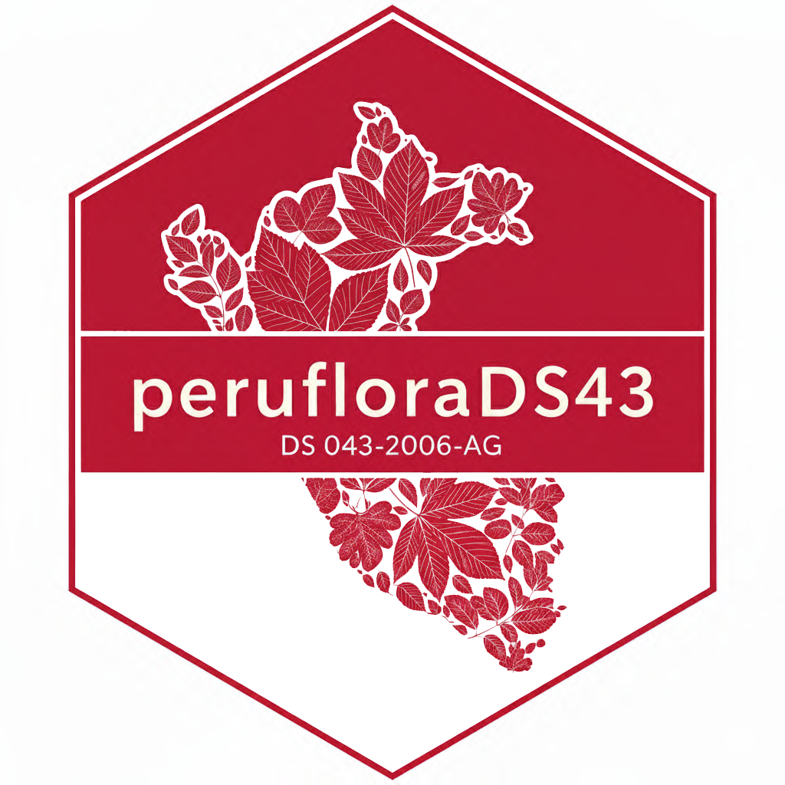

<!-- README.md is generated from README.Rmd. Please edit that file -->

```{r, include = FALSE}
knitr::opts_chunk$set(
  collapse = TRUE,
  comment = "#>",
  fig.path = "man/figures/README-",
  out.width = "100%"
)
```

# peruflorads43 

<!-- badges: start -->
[](https://lifecycle.r-lib.org/articles/stages.html#stable)
[](https://CRAN.R-project.org/package=peruflorads43)
[](https://github.com/PaulESantos/peruflorads43/actions/workflows/R-CMD-check.yaml)
[](https://app.codecov.io/gh/PaulESantos/peruflorads43?branch=master)
[](https://cran.r-project.org/package=peruflorads43)
[](https://cran.r-project.org/package=peruflorads43)
<!-- badges: end -->


## Overview

**peruflorads43** provides comprehensive tools for working with Peru's official threatened plant species list as established by Supreme Decree **DS 043-2006-AG** (July 13, 2006). The package enables researchers, conservation practitioners, and environmental consultants to:

- **Validate species protection status** against the official decree
- **Match species names** with advanced algorithms handling taxonomic changes
- **Access complete threat data** for 776+ threatened plant species
- **Handle nomenclatural updates** automatically since 2006


## Key Features

### Intelligent Name Matching

- **Hierarchical matching pipeline**: Direct → Genus → Fuzzy → Suffix matching
- **Handles taxonomic complexity**: Works with binomial and infraspecific taxa
- **Automatic standardization**: Deals with variations in formatting and spelling
- **Ambiguity detection**: Identifies and reports uncertain matches for manual review

### Dual Database System

- **Original nomenclature (2006)**: Preserves names as published in DS 043-2006-AG
- **Updated nomenclature (2025)**: Reflects current taxonomic consensus (WCVP/POWO)
- **Synonym resolution**: Links historical names to accepted names automatically


## Installation

Install the stable version from CRAN:
```r
install.packages("peruflorads43")
```

Or install the development version from GitHub:
```r
# Using pak (recommended)
pak::pak("PaulESantos/peruflorads43")

# Or using remotes
remotes::install_github("PaulESantos/peruflorads43")
```

## Quick Start

### Basic Usage

Check if species are threatened:
```{r}
library(peruflorads43)

# Simple vector of species names
species_list <- c(
  "Cattleya maxima",           # Orchid - Endangered
  "Polylepis incana",          # Queñua tree - Vulnerable  
  "Persea americana"           # Avocado - Not threatened
)

# Check threat status
tibble::tibble(splist = species_list) |> 
  dplyr::mutate(ds43 = is_threatened_peru(splist))

```

### Detailed Matching Results

Get comprehensive matching information:

```{r}
# Detailed results with matching metadata
results <- is_threatened_peru(species_list, return_details = TRUE)

# View key columns
results |> 
  dplyr::select(Orig.Name, Matched.Name, Threat.Status, Match.Level)

```

### DS 043-2006-AG Validation

Check protection status under the official decree:

```{r}
# Species with nomenclatural changes
species <- c(
  "Haageocereus acranthus subsp. olowinskianus",  # Original name (2006)
  "Brassia ocanensis",                            # Updated name (was Ada)
  "Persea americana"                              # Not threatened
)

# Consolidated search across both databases
tibble::tibble(species) |> 
dplyr::mutate(status = is_ds043_2006_ag(species))


# Detailed reconciliation
details <- is_ds043_2006_ag(species, return_details = TRUE)

details |>
  dplyr::select(Input.Name, Consolidated.Status, Final.Source, Nomenclature.Status)
```

### Handling Fuzzy Matches

The package automatically handles misspellings and variations:

```{r}
# Species with typos
species_fuzzy <- c(
  "Catleya maxima",      # Missing 't' in Cattleya
  "Polylepys incana"     # Wrong spelling of Polylepis
)

results <- is_threatened_peru(species_fuzzy, return_details = TRUE)

# Check fuzzy matching quality
results |>
  dplyr::select(Orig.Name, Matched.Name, Threat.Status, 
         fuzzy_genus_dist, fuzzy_match_genus)
```

### Reviewing Ambiguous Matches

When multiple candidates have identical match scores:
```{r}
# Get ambiguous matches for quality control
ambiguous <- get_ambiguous_matches(results, type = "all")

# Save for manual curation
if (!is.null(ambiguous)) {
  get_ambiguous_matches(
    results, 
    type = "genus",
    save_to_file = TRUE
  )
}
```

## Database Structure

### Original Database (DS 043-2006-AG 2006)

```{r}
# Access original nomenclature
db_original <- get_threatened_database(type = "original")

# Summary statistics
get_database_summary("original")

```

**Key characteristics:**

- 776+ species as listed in 2006
- Includes both accepted names and synonyms
- Original infraspecific rank formatting

### Updated Database (Current Nomenclature)

```{r}
# Access updated nomenclature
db_updated <- get_threatened_database(type = "updated")

# Compare with original
get_database_summary("both")
```

**Key characteristics:**
- Current taxonomic consensus (WCVP/POWO)
- Supports trinomial names
- Only accepted names (synonyms resolved)
- Updated to 2025 nomenclature

## Advanced Features

### Comparison Between Databases

```{r}
# Side-by-side comparison
comparison <- comparison_table_ds043(species)

comparison |>
 dplyr::select(input_species, status_original, status_updated, 
         nomenclature_status, protected_by_ds_043)
```


## Legal Framework

**Supreme Decree DS 043-2006-AG**  
*Aprueban Categorización de Especies Amenazadas de Flora Silvestre*

Issued by: Ministry of Agriculture, Peru  
Date: July 13, 2006  

### IUCN Threat Categories

| Category | Code | Spanish | Description |
|----------|------|---------|-------------|
| Critically Endangered | **CR** | En Peligro Crítico | Extremely high risk of extinction |
| Endangered | **EN** | En Peligro | Very high risk of extinction |
| Vulnerable | **VU** | Vulnerable | High risk of extinction |
| Near Threatened | **NT** | Casi Amenazado | Close to qualifying for threatened status |

## Use Cases

### 1. Environmental Impact Assessment (EIA)
```{r}
# Species list from field survey
field_species <- c("Achyrocline saturejoides", "Bouteloua simplex", "Jarava ichu", "Cenchrus clandestinus", "Grindelia boliviana", "Tagetes filifolia", "Bidens pilosa", "Cumulopuntia boliviana", "Ageratina sternbergiana", "Roca", "Nassella inconspicua", "Dalea sp", "Baccharis tricuneata", "Lepechinia meyenii", "Erodium cicutarium", "Suelo", "Ephedra rupestris", "Achyrocline saturejoides", "Ageratina sternbergiana", "Astragalus garbancillo", "Baccharis tola", "Bidens pilosa", "Bouteloua simplex", "Cenchrus clandestinus", "Cumulopuntia boliviana", "Jarava ichu")

tibble::tibble(field_species) |> 
  dplyr::mutate(status = is_ds043_2006_ag(field_species)) |> 
  dplyr::filter(status != "Not threatened")

# Check DS 043 protection status
results <- is_ds043_2006_ag(field_species, return_details = TRUE)

results

# Generate report 
results |>
  dplyr::filter(Protected.DS043 == TRUE) |>
  dplyr::select(Input.Name, Consolidated.Status, Final.Source)


```


### 1. Research and Monitoring
```{r}
# Historical species records
historical_names <- c(
  "Lycaste locusta",     # Old name
  "Ida locusta"          # Current accepted name
)

# Check nomenclatural updates
nomenclature_check <- is_ds043_2006_ag(
  historical_names, 
  return_details = TRUE
)

# Identify synonyms
nomenclature_check |>
  dplyr::filter(Is.Synonym == TRUE) |>
  dplyr::select(Input.Name, Accepted.Name, Nomenclature.Status)
```

## Algorithm Details

### Hierarchical Matching Pipeline

1. **Direct Match** (Node 1)
   - Exact matching for full scientific names
   - Handles binomial, trinomial, and quaternomial names
   - Fastest and most reliable method

2. **Genus Match** (Nodes 2-3)
   - Exact genus matching
   - Fuzzy genus matching (Levenshtein distance ≤ 1)
   - Foundation for species-level matching

3. **Species Match** (Nodes 4-5)
   - Direct species epithet matching within genus
   - Fuzzy species matching (Levenshtein distance ≤ 1)

4. **Infraspecies Match** (Nodes 6-7)
   - Direct infraspecific rank matching (SUBSP., VAR., F., etc.)
   - Fuzzy infraspecific epithet matching
   - Support for two-level infraspecies (Rank 4, original database only)

### Rank Validation

The algorithm implements **strict rank validation** to prevent false positives:

```r
# Example: User inputs trinomial, database has binomial
# Input:  "Cattleya maxima var. alba" (Rank 3, doesn't exist)
# Database: "Cattleya maxima" (Rank 2, exists)
# Result: NO MATCH (correct) - prevents false positive
```

This ensures taxonomic precision and avoids inappropriate matches.

## Performance Considerations

### Duplicate Handling

The package automatically handles duplicate names efficiently:
```{r}
# Input with duplicates
species_dup <- c(
  "Cattleya maxima", 
  "Polylepis incana", 
  "Cattleya maxima"  # Duplicate
)

results <- matching_threatenedperu(species_dup)
results

```


## Citation

If you use **peruflorads43** in your research, please cite:

```{r}
citation("peruflorads43")
```


**Legal reference:**

Ministerio de Agricultura. (2006). Decreto Supremo N° 043-2006-AG: Aprueban Categorización de Especies Amenazadas de Flora Silvestre. El Peruano, July 13, 2006.


---

**Disclaimer**: This package implements DS 043-2006-AG for research and conservation purposes. For official legal determinations, consult the original decree and relevant Peruvian authorities.
